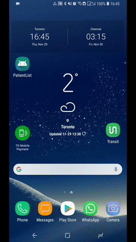
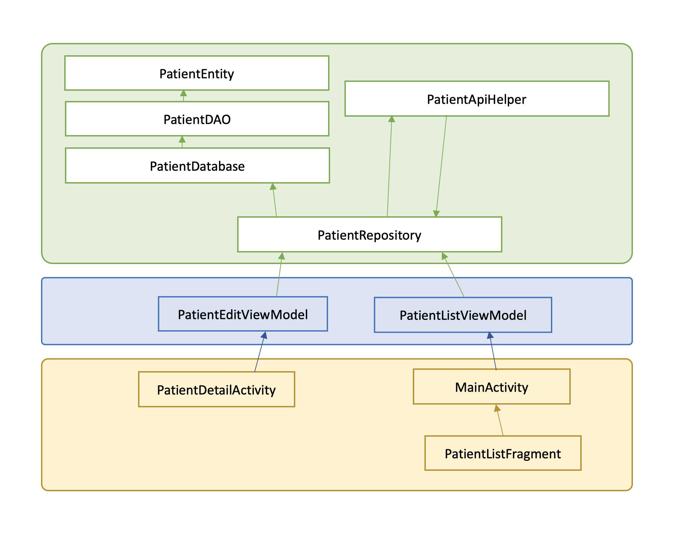
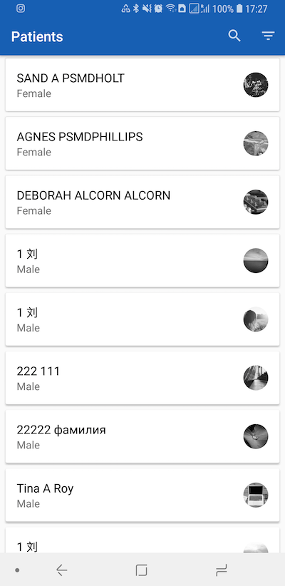
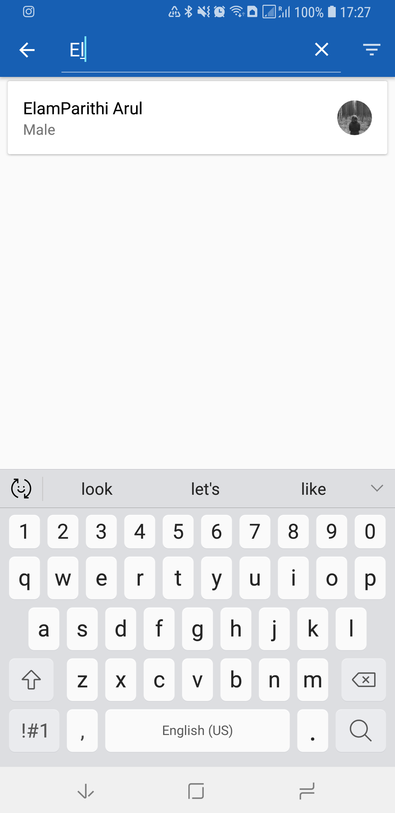
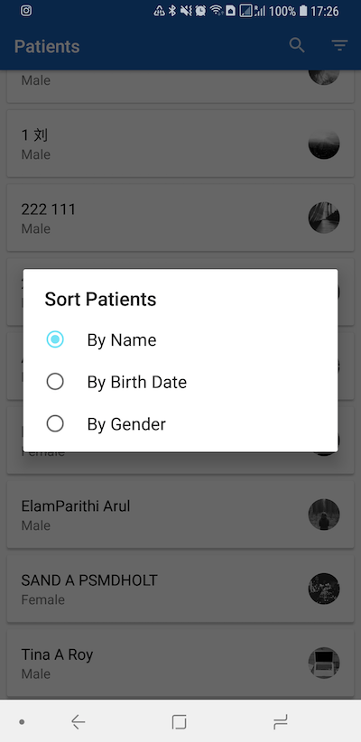
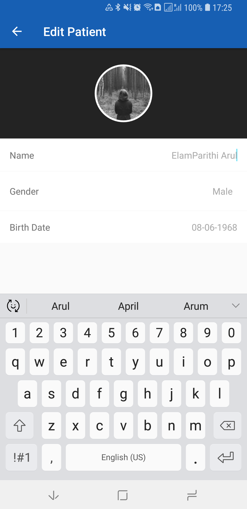
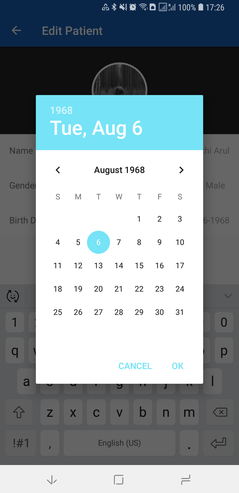

# PatientList - Advanced Version

Technology Used : Java, FHIR, Android Studio

Libraries Used : ButterKnife, Room, Android Architecture components, Glide

### Demo

### Class Structure

### Screens

#### List Screen

#### Search Screen

#### Filter Screen

#### Edit Screen

#### Change Date Screen

